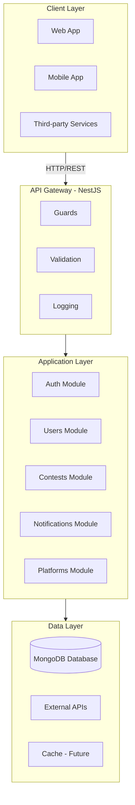

# Architecture Overview

Understanding CodeNotify's Server architecture and design patterns.

## System Architecture



## Module Structure

### Core Modules

#### 1. Auth Module
**Purpose**: Authentication and authorization

**Components**:
- `AuthController` - Signup, signin, refresh, signout endpoints
- `AuthService` - JWT generation, password hashing
- `JwtStrategy` - Passport JWT strategy
- `JwtAuthGuard` - Route protection
- `RolesGuard` - Role-based access control

**Key Features**:
- JWT access tokens (15 min)
- Refresh tokens (7 days)
- Bcrypt password hashing
- Role-based authorization

#### 2. Users Module
**Purpose**: User management and profiles

**Components**:
- `UsersController` - 8 endpoints (profile, list, role, delete)
- `UsersService` - User CRUD operations
- `UserSchema` - MongoDB schema with preferences
- `UserDto` - Zod validation schemas

**Key Features**:
- User preferences (platforms, notifications)
- Account activation/deactivation
- Role management (user/admin)
- Profile customization

#### 3. Contests Module
**Purpose**: Contest aggregation and management

**Components**:
- `ContestsController` - 19 endpoints (CRUD, search, filter, sync)
- `ContestsService` - Contest operations
- `ContestSchema` - Multi-platform schema
- `ContestSchedulerService` - Scheduled jobs

**Key Features**:
- Multi-platform support (4 platforms)
- Automatic sync (every 6 hours)
- Full-text search
- Advanced filtering
- Analytics and statistics

#### 4. Notifications Module
**Purpose**: Multi-channel notifications

**Components**:
- `NotificationsService` - Notification logic
- `EmailService` - Email via Resend
- `WhatsAppService` - WhatsApp integration

**Key Features**:
- Multi-channel (email, WhatsApp, push)
- User preference-based
- Scheduled checks (every 30 min)
- Customizable timing

#### 5. Platforms Module
**Purpose**: Platform adapter registry

**Components**:
- `PlatformAdapter` - Interface
- `CodeforcesAdapter` - Codeforces integration
- `LeetCodeAdapter` - LeetCode GraphQL
- `CodeChefAdapter` - CodeChef REST API
- `AtCoderAdapter` - AtCoder integration

**Key Features**:
- Adapter pattern
- Unified data format
- Retry logic
- Health checks

## Design Patterns

### 1. Adapter Pattern

**Purpose**: Abstract platform-specific implementations

```typescript
interface PlatformAdapter {
  platformName: string;
  enabled: boolean;
  fetchContests(): Promise<ContestData[]>;
  healthCheck(): Promise<boolean>;
}

class CodeforcesAdapter implements PlatformAdapter {
  platformName = 'codeforces';
  enabled = true;
  
  async fetchContests(): Promise<ContestData[]> {
    // Codeforces-specific implementation
  }
}
```

**Benefits**:
- Easy to add new platforms
- Loose coupling
- Testable in isolation

### 2. Dependency Injection

**Purpose**: Loose coupling and testability

```typescript
@Injectable()
export class ContestsService {
  constructor(
    @InjectModel(Contest.name) private contestModel: Model<ContestDocument>,
    @Inject(PLATFORM_ADAPTERS) private adapters: PlatformAdapter[],
  ) {}
}
```

**Benefits**:
- Testable with mocks
- Flexible configuration
- Clear dependencies

### 3. Repository Pattern

**Purpose**: Abstract data access

```typescript
@Injectable()
export class UsersService {
  constructor(
    @InjectModel(User.name) private userModel: Model<UserDocument>,
  ) {}
  
  async findById(id: string): Promise<User> {
    return this.userModel.findById(id);
  }
}
```

**Benefits**:
- Database agnostic
- Centralized queries
- Easy to test

### 4. Guard Pattern

**Purpose**: Route protection

```typescript
@UseGuards(JwtAuthGuard, RolesGuard)
@Roles('admin')
@Delete(':id')
async deleteUser(@Param('id') id: string) {
  // Only admins can access
}
```

**Benefits**:
- Declarative security
- Reusable guards
- Clear authorization

## Data Flow

### Authentication Flow

```
1. Client → POST /auth/signup
2. AuthService → Hash password
3. UsersService → Create user in DB
4. AuthService → Generate JWT tokens
5. Response → { user, accessToken, refreshToken }
```

### Contest Sync Flow

```
1. Scheduler → Trigger sync (every 6 hours)
2. ContestsService → Get all platform adapters
3. For each adapter:
   a. Fetch contests from platform API
   b. Transform to internal format
   c. Upsert to MongoDB
4. Log results (synced, updated, failed)
```

### Notification Flow

```
1. Scheduler → Check upcoming contests (every 30 min)
2. ContestsService → Find contests in notification window
3. For each contest:
   a. Get users with matching preferences
   b. Check if already notified
   c. Send via preferred channels
   d. Mark as notified
```

## Database Schema

### User Schema

```typescript
{
  email: string (unique, indexed)
  password: string (hashed)
  name: string
  phoneNumber?: string
  role: 'user' | 'admin' (indexed)
  preferences: {
    platforms: string[]
    alertFrequency: string
    contestTypes: string[]
    notificationChannels: string[]
    notifyBefore: number
  }
  isActive: boolean (indexed)
  refreshToken?: string
  lastLogin?: Date
  createdAt: Date
  updatedAt: Date
}
```

### Contest Schema

```typescript
{
  platformId: string (indexed)
  name: string (indexed, text search)
  platform: enum (indexed)
  phase: enum (indexed)
  type: enum
  startTime: Date (indexed)
  endTime: Date
  durationMinutes: number
  description?: string (text search)
  websiteUrl?: string
  difficulty?: enum
  participantCount?: number
  problemCount?: number
  platformMetadata: object
  isActive: boolean (indexed)
  isNotified: boolean (indexed)
  lastSyncedAt?: Date
  createdAt: Date
  updatedAt: Date
}
```

**Indexes**:
- `{ platformId: 1, platform: 1 }` - Unique
- `{ platform: 1, startTime: 1 }` - Compound
- `{ platform: 1, phase: 1 }` - Compound
- `{ name: 'text', description: 'text' }` - Full-text

## API Layers

### 1. Controller Layer

**Responsibilities**:
- HTTP request handling
- Input validation
- Response formatting
- Route protection

```typescript
@Controller('contests')
export class ContestsController {
  @Get('upcoming')
  async getUpcoming(): Promise<ContestResponseDto[]> {
    return this.contestsService.findUpcoming();
  }
}
```

### 2. Service Layer

**Responsibilities**:
- Business logic
- Data transformation
- External API calls
- Error handling

```typescript
@Injectable()
export class ContestsService {
  async findUpcoming(): Promise<Contest[]> {
    return this.contestModel.find({
      startTime: { $gt: new Date() },
      isActive: true
    }).sort({ startTime: 1 });
  }
}
```

### 3. Data Layer

**Responsibilities**:
- Database operations
- Schema definitions
- Indexes and constraints

```typescript
@Schema({ timestamps: true })
export class Contest {
  @Prop({ required: true })
  name: string;
  
  @Prop({ type: Date, required: true, index: true })
  startTime: Date;
}
```

## Security Architecture

### Authentication

- **JWT Access Tokens**: Short-lived (15 min)
- **Refresh Tokens**: Long-lived (7 days)
- **Password Hashing**: Bcrypt with salt rounds
- **Token Storage**: Secure httpOnly cookies (recommended)

### Authorization

- **Role-Based**: User vs Admin
- **Guard-Based**: Declarative with decorators
- **Resource-Based**: Owner-only access

### Input Validation

- **Zod Schemas**: Type-safe validation
- **DTO Classes**: Request/response types
- **Pipe Validation**: Automatic validation

## Scalability Considerations

### Horizontal Scaling

- **Stateless API**: No session storage
- **JWT Tokens**: Self-contained
- **Database Connection Pool**: Configurable size
- **Load Balancer Ready**: Health check endpoint

### Performance Optimization

- **Database Indexes**: Optimized queries
- **Pagination**: Limit result sets
- **Caching**: Future implementation
- **Async Operations**: Non-blocking I/O

### Monitoring

- **Logging**: Structured logs
- **Health Checks**: `/contests/health`
- **Error Tracking**: Comprehensive error handling
- **Metrics**: Future implementation

## Technology Stack

### Core
- **NestJS** - Framework
- **TypeScript** - Language
- **MongoDB** - Database
- **Mongoose** - ODM

### Authentication
- **Passport** - Auth middleware
- **JWT** - Token format
- **Bcrypt** - Password hashing

### Validation
- **Zod** - Schema validation
- **class-validator** - DTO validation

### Scheduling
- **@nestjs/schedule** - Cron jobs
- **node-cron** - Scheduler

### HTTP Client
- **Axios** - HTTP requests
- **@nestjs/axios** - NestJS integration

### Notifications
- **Resend** - Email service

## Best Practices

### ✅ Do

1. **Use DTOs** for all requests/responses
2. **Validate** all inputs with Zod
3. **Use guards** for route protection
4. **Log** important operations
5. **Handle errors** gracefully
6. **Use indexes** for queries
7. **Paginate** large result sets
8. **Test** all critical paths

### ❌ Don't

1. **Don't expose** internal errors
2. **Don't skip** validation
3. **Don't hardcode** secrets
4. **Don't ignore** security
5. **Don't block** event loop
6. **Don't skip** error handling

## Related Documentation

- [Authentication Flow](/guide/authentication)
- [Notification System](/guide/notifications)
- [Platform Integrations](/guide/platforms)
- [Server Modules](/server/modules)
