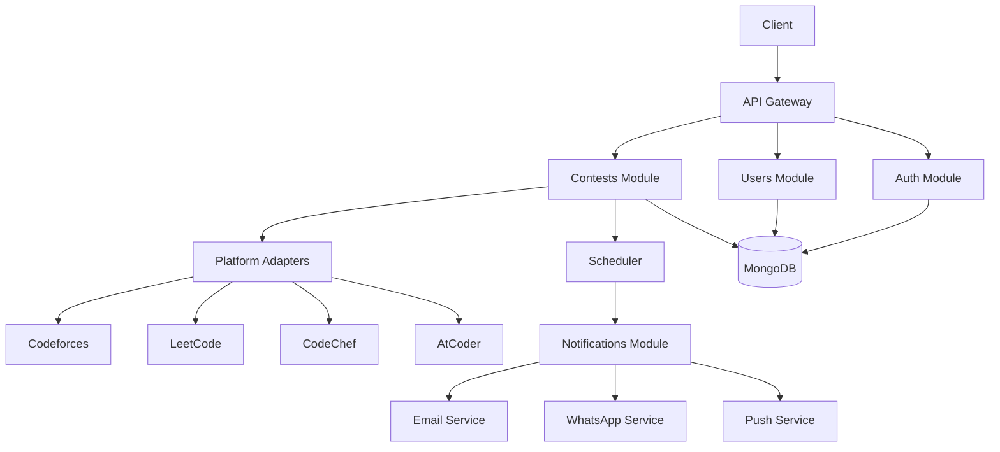

## Quick Start

::: code-group

```bash [npm]
# Clone the repository
git clone https://github.com/Celestial-0/CodeNotify.git
cd CodeNotify

# Install server dependencies
cd server
npm install

# Configure environment
cp .env.example .env.local
# Edit .env.local with your configuration

# Start development server
npm run start:dev
```

```bash [yarn]
# Clone the repository
git clone https://github.com/Celestial-0/CodeNotify.git
cd CodeNotify

# Install server dependencies
cd server
yarn install

# Configure environment
cp .env.example .env.local
# Edit .env.local with your configuration

# Start development server
yarn start:dev
```

:::

## Tech Stack

<div class="tech-stack-container">

<div class="tech-card">
  <h3>Server</h3>
  <div class="tech-items">
    <div class="tech-item">
      <span class="tech-name">NestJS 11</span>
      <span class="tech-desc">Server framework with TypeScript 5.9</span>
    </div>
    <div class="tech-item">
      <span class="tech-name">MongoDB</span>
      <span class="tech-desc">NoSQL database with Mongoose ODM</span>
    </div>
    <div class="tech-item">
      <span class="tech-name">Passport JWT</span>
      <span class="tech-desc">Authentication with bcrypt</span>
    </div>
    <div class="tech-item">
      <span class="tech-name">Zod</span>
      <span class="tech-desc">Runtime validation & type safety</span>
    </div>
  </div>
</div>

<div class="tech-card">
  <h3>Platform Integrations</h3>
  <div class="tech-items">
    <div class="tech-item">
      <span class="tech-name">Codeforces</span>
      <span class="tech-desc">REST API integration</span>
    </div>
    <div class="tech-item">
      <span class="tech-name">LeetCode</span>
      <span class="tech-desc">GraphQL API integration</span>
    </div>
    <div class="tech-item">
      <span class="tech-name">CodeChef</span>
      <span class="tech-desc">REST API integration</span>
    </div>
    <div class="tech-item">
      <span class="tech-name">AtCoder</span>
      <span class="tech-desc">Community API integration</span>
    </div>
  </div>
</div>

<div class="tech-card">
  <h3>Notification Services</h3>
  <div class="tech-items">
    <div class="tech-item">
      <span class="tech-name">Resend</span>
      <span class="tech-desc">Email notifications</span>
    </div>
    <div class="tech-item">
      <span class="tech-name">WhatsApp</span>
      <span class="tech-desc">Cloud API messaging</span>
    </div>
    <div class="tech-item">
      <span class="tech-name">Push</span>
      <span class="tech-desc">Mobile push alerts</span>
    </div>
  </div>
</div>

</div>

## API Endpoints Overview

CodeNotify provides a comprehensive REST API with 40+ endpoints organized into logical modules:

::: details **Authentication Endpoints** (6)
- [Sign Up](/api/auth/signup) - Create new user account
- [Sign In](/api/auth/signin) - Authenticate user
- [Refresh Token](/api/auth/refresh) - Get new access token
- [Sign Out](/api/auth/signout) - Invalidate tokens
- `GET /auth/me` - Get current user profile
- `POST /auth/verify-email` - Verify email address
:::

::: details **Users Endpoints** (8 endpoints)
- `GET /users/profile` - Get user profile
- `PATCH /users/profile` - Update user profile
- `GET /users/preferences` - Get notification preferences
- `PATCH /users/preferences` - Update notification preferences
- `GET /users/platforms` - Get selected platforms
- `PATCH /users/platforms` - Update platform preferences
- `DELETE /users/account` - Delete user account
- `GET /users/stats` - Get user statistics
:::

::: details **Contests Endpoints** (18 endpoints)
- `GET /contests` - List all contests (paginated)
- `GET /contests/:id` - Get contest by ID
- `POST /contests` - Create contest (admin)
- `PATCH /contests/:id` - Update contest (admin)
- `DELETE /contests/:id` - Delete contest (admin)
- `GET /contests/platform/:platform` - Filter by platform
- `GET /contests/upcoming` - Get upcoming contests
- `GET /contests/running` - Get running contests
- `GET /contests/finished` - Get finished contests
- `GET /contests/search` - Search contests
- `GET /contests/difficulty/:level` - Filter by difficulty
- `GET /contests/type/:type` - Filter by contest type
- `GET /contests/stats` - Get global statistics
- `GET /contests/stats/:platform` - Get platform statistics
- `POST /contests/sync/:platform` - Sync platform contests
- `POST /contests/sync/all` - Sync all platforms
- `POST /contests/bulk` - Bulk create contests
- `GET /contests/health` - Health check
:::

::: details **Notifications Endpoints** (8 endpoints)
- `GET /notifications` - List user notifications
- `GET /notifications/:id` - Get notification by ID
- `PATCH /notifications/:id/read` - Mark as read
- `PATCH /notifications/read-all` - Mark all as read
- `DELETE /notifications/:id` - Delete notification
- `POST /notifications/test` - Send test notification
- `GET /notifications/stats` - Get notification statistics
- `GET /notifications/history` - Get notification history
:::

## Architecture Overview



## What's Next?

<div class="next-steps">

### 📚 Getting Started
- **[Introduction](/guide/introduction)** - Learn about CodeNotify's features and capabilities
- **[Quick Start](/guide/quick-start)** - Get up and running in 5 minutes
- **[Installation](/guide/installation)** - Detailed installation and setup guide
- **[Configuration](/guide/configuration)** - Environment variables and configuration options

### 🔌 API Documentation
- **[API Overview](/api/overview)** - Complete REST API reference with 40+ endpoints
- **[Authentication](/api/authentication)** - JWT authentication flow and token management
- **[Contests API](/api/contests)** - Contest CRUD, filtering, search, and statistics
- **[Notifications API](/api/notifications)** - Multi-channel notification management

### 🏗️ Server Deep Dive
- **[System Architecture](/server/architecture)** - High-level architecture and module interaction
- **[Core Modules](/server/modules)** - Auth, Users, Contests, Notifications, Integrations
- **[Platform Adapters](/server/adapters)** - Adapter pattern for Codeforces, LeetCode, CodeChef, AtCoder
- **[Database Design](/server/database)** - MongoDB schemas, indexes, and performance optimization
- **[Scheduler & Jobs](/server/scheduler)** - Cron-based automated tasks and background jobs

### 🚀 Security
- **[JWT Authentication](/server/security/jwt)** - JWT tokens and authentication flow
- **[Security Guards](/server/security/guards)** - Route protection and RBAC

### 💻 Client Architecture
- **[Client Overview](/client/README)** - Next.js App Router structure
- **[Authentication](/client/auth)** - Auth flows & Verify Email
- **[Admin Dashboard](/client/admin)** - Management panels
- **[API Integration](/client/api-integration)** - Axios & React Query architecture
- **[State Management](/client/state-management)** - Zustand stores

</div>

<style>
.tech-stack-container {
  display: grid;
  grid-template-columns: repeat(auto-fit, minmax(280px, 1fr));
  gap: 1.5rem;
  margin: 2.5rem 0;
}

.tech-card {
  background: var(--vp-c-bg-soft);
  border: 1px solid var(--vp-c-divider);
  border-radius: 8px;
  padding: 1.75rem;
  transition: border-color 0.2s ease;
}

.tech-card:hover {
  border-color: var(--vp-c-brand-light);
}

.tech-card h3 {
  margin: 0 0 1.25rem 0;
  font-size: 1rem;
  font-weight: 600;
  color: var(--vp-c-text-1);
  text-transform: uppercase;
  letter-spacing: 0.05em;
  padding-bottom: 0.75rem;
  border-bottom: 1px solid var(--vp-c-divider);
}

.tech-items {
  display: flex;
  flex-direction: column;
  gap: 1.25rem;
}

.tech-item {
  display: flex;
  flex-direction: column;
  gap: 0.375rem;
}

.tech-name {
  font-size: 0.9375rem;
  font-weight: 500;
  color: var(--vp-c-text-1);
  letter-spacing: -0.01em;
}

.tech-desc {
  font-size: 0.8125rem;
  color: var(--vp-c-text-2);
  line-height: 1.5;
}

.next-steps {
  margin: 2rem 0;
}

.next-steps a {
  display: block;
  margin: 0.5rem 0;
  font-weight: 600;
}

/* Responsive design */
@media (max-width: 768px) {
  .tech-stack-container {
    grid-template-columns: 1fr;
    gap: 1.25rem;
  }
  
  .tech-card {
    padding: 1.5rem;
  }
}
</style>
