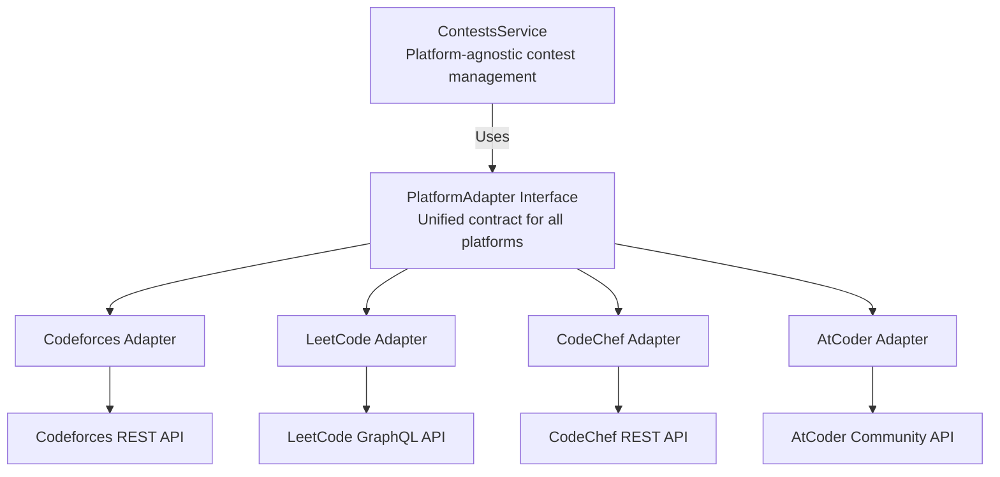

# Platform Adapter Pattern

CodeNotify uses the **Adapter Pattern** to integrate multiple competitive programming platforms with a unified interface.

## Architecture Overview



## Benefits

### 1. **Loose Coupling**
- ContestsService doesn't depend on specific platform implementations
- Easy to add/remove platforms without affecting core logic
- Platform changes don't impact other parts of the system

### 2. **Extensibility**
- Add new platforms by implementing PlatformAdapter interface
- No changes required to existing code
- Platform-specific logic is encapsulated

### 3. **Testability**
- Mock adapters for testing
- Test each platform independently
- Integration tests without external API calls

### 4. **Maintainability**
- Clear separation of concerns
- Platform-specific code in dedicated modules
- Easy to debug and update individual platforms

## Core Interfaces

### PlatformAdapter Interface

```typescript
export interface PlatformAdapter {
  // Platform identification
  readonly platformName: ContestPlatform;
  
  // Core methods
  fetchContests(): Promise<ContestData[]>;
  fetchUpcomingContests(): Promise<ContestData[]>;
  fetchRunningContests(): Promise<ContestData[]>;
  transformToInternalFormat(data: any): ContestData;
  healthCheck(): Promise<boolean>;
}
```

### PlatformConfig Interface

```typescript
export interface PlatformConfig {
  enabled: boolean;           // Enable/disable adapter
  apiUrl: string;            // Base API URL
  timeout: number;           // Request timeout (ms)
  rateLimit?: {              // Optional rate limiting
    maxRequests: number;
    windowMs: number;
  };
  retryAttempts?: number;    // Max retry attempts (default: 3)
  retryDelay?: number;       // Retry delay (ms, default: 1000)
}
```

### ContestData Interface

Unified contest format used internally:

```typescript
export interface ContestData {
  platformId: string;           // Platform-specific ID
  name: string;                 // Contest name
  platform: ContestPlatform;    // Platform enum
  phase: ContestPhase;          // BEFORE, CODING, FINISHED
  type: ContestType;            // Platform-specific type
  startTime: Date;              // Start timestamp
  endTime: Date;                // End timestamp
  durationMinutes: number;      // Duration in minutes
  description?: string;         // Contest description
  websiteUrl?: string;          // Contest URL
  registrationUrl?: string;     // Registration URL
  preparedBy?: string;          // Contest author
  difficulty?: DifficultyLevel; // Difficulty level
  participantCount?: number;    // Number of participants
  problemCount?: number;        // Number of problems
  country?: string;             // Country (if applicable)
  city?: string;                // City (if applicable)
  platformMetadata?: Record<string, any>; // Platform-specific data
  isActive: boolean;            // Active status
}
```

## Base Adapter Implementation

### BasePlatformAdapter (Abstract Class)

Provides common functionality for all adapters:

```typescript
export abstract class BasePlatformAdapter implements PlatformAdapter {
  protected readonly logger: Logger;
  
  abstract readonly platformName: ContestPlatform;
  
  constructor(public readonly config: PlatformConfig) {
    this.logger = new Logger(this.constructor.name);
  }
  
  // Common HTTP request handling with fetch API
  protected async makeRequest<T>(
    url: string,
    options?: RequestInit
  ): Promise<T> {
    const maxAttempts = this.config.retryAttempts || 3;
    const retryDelay = this.config.retryDelay || 1000;
    
    for (let attempt = 1; attempt <= maxAttempts; attempt++) {
      try {
        const controller = new AbortController();
        const timeoutId = setTimeout(
          () => controller.abort(),
          this.config.timeout
        );
        
        const response = await fetch(url, {
          ...options,
          signal: controller.signal,
          headers: {
            'User-Agent': 'CodeNotify/1.0',
            ...options?.headers,
          },
        });
        
        clearTimeout(timeoutId);
        
        if (!response.ok) {
          throw new Error(`HTTP ${response.status}: ${response.statusText}`);
        }
        
        return await response.json() as T;
      } catch (error) {
        this.logger.error(
          `Request failed (attempt ${attempt}/${maxAttempts}): ${this.getErrorMessage(error)}`
        );
        
        if (attempt === maxAttempts) {
          throw new Error(
            `Failed to fetch data from ${this.platformName} after ${maxAttempts} attempts`
          );
        }
        
        await this.sleep(retryDelay * attempt);
      }
    }
    
    throw new Error(`Failed to fetch data from ${this.platformName}`);
  }
  
  // Utility methods
  protected sleep(ms: number): Promise<void> {
    return new Promise(resolve => setTimeout(resolve, ms));
  }
  
  protected getErrorMessage(error: unknown): string {
    if (error instanceof Error) return error.message;
    if (typeof error === 'object' && error !== null) return JSON.stringify(error);
    return String(error);
  }
  
  protected unixToDate(timestamp: number): Date {
    return new Date(timestamp * 1000);
  }
  
  protected calculateDuration(startTime: Date, endTime: Date): number {
    return Math.round((endTime.getTime() - startTime.getTime()) / (1000 * 60));
  }
  
  protected filterUpcoming(contests: ContestData[]): ContestData[] {
    const now = new Date();
    return contests.filter(contest => contest.startTime > now);
  }
  
  protected filterRunning(contests: ContestData[]): ContestData[] {
    const now = new Date();
    return contests.filter(
      contest => contest.startTime <= now && contest.endTime >= now
    );
  }
  
  // Abstract methods (must be implemented)
  abstract fetchContests(): Promise<ContestData[]>;
  abstract fetchUpcomingContests(): Promise<ContestData[]>;
  abstract fetchRunningContests(): Promise<ContestData[]>;
  abstract transformToInternalFormat(data: any): ContestData;
  abstract healthCheck(): Promise<boolean>;
}
```

## Platform Registry Pattern

### Factory Provider

```typescript
// platforms.module.ts
import { PLATFORM_ADAPTERS_TOKEN } from '../../common/common.constants';

export const PLATFORM_ADAPTERS = PLATFORM_ADAPTERS_TOKEN;

@Module({
  imports: [
    CodeforcesModule,
    LeetcodeModule,
    CodechefModule,
    AtcoderModule
  ],
  providers: [
    {
      provide: PLATFORM_ADAPTERS_TOKEN,
      useFactory: (
        codeforces: CodeforcesAdapter,
        leetcode: LeetCodeAdapter,
        codechef: CodeChefAdapter,
        atcoder: AtCoderAdapter
      ): PlatformAdapter[] => {
        // Only return enabled adapters
        return [codeforces, leetcode, codechef, atcoder].filter(
          adapter => adapter.config.enabled
        );
      },
      inject: [
        CodeforcesAdapter,
        LeetCodeAdapter,
        CodeChefAdapter,
        AtCoderAdapter
      ]
    }
  ],
  exports: [
    PLATFORM_ADAPTERS,
    CodeforcesModule,
    LeetcodeModule,
    CodechefModule,
    AtcoderModule
  ]
})
export class PlatformsModule {}
```

### Usage in ContestsService

```typescript
@Injectable()
export class ContestsService {
  private platformAdapters: Map<ContestPlatform, PlatformAdapter> = new Map();
  
  constructor(
    @InjectModel(Contest.name) private contestModel: Model<ContestDocument>,
    @Inject(PLATFORM_ADAPTERS) adapters: PlatformAdapter[]
  ) {
    // Register all platform adapters
    adapters.forEach(adapter => {
      this.platformAdapters.set(adapter.platformName, adapter);
      this.logger.log(`Registered platform adapter: ${adapter.platformName}`);
    });
  }
  
  async syncPlatform(platform: ContestPlatform) {
    const adapter = this.platformAdapters.get(platform);
    if (!adapter) {
      throw new Error(`Platform ${platform} not registered`);
    }
    
    const contests = await adapter.fetchContests();
    return await this.upsertContests(contests);
  }
}
```

## Platform Implementations

### 1. Codeforces Adapter

**API Type**: REST API  
**Endpoint**: `https://codeforces.com/api/contest.list`  
**Status**: ✅ Enabled

**Features**:
- Fetches all contests (past, present, future)
- Supports contest phases (BEFORE, CODING, FINISHED)
- Detects contest types (CF, CF_IOI, ICPC)
- Tracks participant count
- Handles frozen contests

**Implementation**:
```typescript
@Injectable()
export class CodeforcesAdapter extends BasePlatformAdapter {
  platformName = ContestPlatform.CODEFORCES;
  isEnabled = true;
  baseUrl = 'https://codeforces.com/api';
  
  async fetchContests(): Promise<ContestData[]> {
    const response = await this.makeRequest<CodeforcesResponse>(
      `${this.baseUrl}/contest.list`
    );
    
    return response.result.map(contest => 
      this.transformToInternalFormat(contest)
    );
  }
  
  transformToInternalFormat(data: CodeforcesContest): ContestData {
    const startTime = new Date(data.startTimeSeconds * 1000);
    const endTime = new Date(startTime.getTime() + data.durationSeconds * 1000);
    
    return {
      platformId: String(data.id),
      name: data.name,
      platform: ContestPlatform.CODEFORCES,
      phase: this.mapPhase(data.phase),
      type: this.mapType(data.type),
      startTime,
      endTime,
      durationMinutes: data.durationSeconds / 60,
      websiteUrl: `https://codeforces.com/contest/${data.id}`,
      difficulty: this.estimateDifficulty(data.type),
      platformMetadata: {
        frozen: data.frozen,
        relativeTimeSeconds: data.relativeTimeSeconds
      },
      isActive: true
    };
  }
}
```

### 2. LeetCode Adapter

**API Type**: GraphQL API  
**Endpoint**: `https://leetcode.com/graphql`  
**Status**: ✅ Enabled

**Features**:
- GraphQL query execution
- Weekly/Biweekly contest detection
- Virtual contest support
- Contest images and metadata
- Title slug handling

**Implementation**:
```typescript
@Injectable()
export class LeetCodeAdapter extends BasePlatformAdapter {
  platformName = ContestPlatform.LEETCODE;
  isEnabled = true;
  baseUrl = 'https://leetcode.com/graphql';
  
  async fetchContests(): Promise<ContestData[]> {
    const query = `
      query {
        allContests {
          title
          titleSlug
          startTime
          duration
          isVirtual
        }
      }
    `;
    
    const response = await this.makeGraphQLRequest(query);
    return response.data.allContests.map(contest =>
      this.transformToInternalFormat(contest)
    );
  }
  
  private async makeGraphQLRequest(query: string): Promise<any> {
    return this.makeRequest(this.baseUrl, {
      method: 'POST',
      data: { query }
    });
  }
}
```

### 3. CodeChef Adapter

**API Type**: REST API  
**Endpoint**: `https://www.codechef.com/api/list/contests/all`  
**Status**: ✅ Enabled

**Features**:
- Present/Future/Past contest categories
- Contest type detection (STARTERS, LUNCH_TIME, COOK_OFF, LONG)
- Division-based contests
- Difficulty mapping

### 4. AtCoder Adapter

**API Type**: Community API  
**Endpoint**: `https://kenkoooo.com/atcoder/resources/contests.json`  
**Status**: ✅ Enabled

**Features**:
- Community-maintained API
- Contest type detection (ABC, ARC, AGC, AHC)
- Rate change metadata
- Time-based filtering

## Adding a New Platform

### Step 1: Create Adapter Interface

```typescript
// src/integrations/platforms/newplatform/newplatform.adapter.ts
import { Injectable } from '@nestjs/common';
import { BasePlatformAdapter } from '../base/platform-adapter.abstract';
import { ContestData, PlatformConfig } from '../base/platform.interface';
import { ContestPlatform, ContestPhase } from '../../../contests/schemas/contest.schema';

@Injectable()
export class NewPlatformAdapter extends BasePlatformAdapter {
  readonly platformName = ContestPlatform.NEWPLATFORM;
  
  constructor() {
    const config: PlatformConfig = {
      enabled: true,
      apiUrl: 'https://api.newplatform.com',
      timeout: 15000,
      retryAttempts: 3,
      retryDelay: 1000,
    };
    super(config);
  }
  
  async fetchContests(): Promise<ContestData[]> {
    const response = await this.makeRequest<ApiResponse>(
      `${this.config.apiUrl}/contests`
    );
    return response.contests.map(contest => 
      this.transformToInternalFormat(contest)
    );
  }
  
  async fetchUpcomingContests(): Promise<ContestData[]> {
    const contests = await this.fetchContests();
    return this.filterUpcoming(contests);
  }
  
  async fetchRunningContests(): Promise<ContestData[]> {
    const contests = await this.fetchContests();
    return this.filterRunning(contests);
  }
  
  transformToInternalFormat(data: any): ContestData {
    const startTime = new Date(data.startTime);
    const endTime = new Date(data.endTime);
    
    return {
      platformId: data.id,
      name: data.name,
      platform: ContestPlatform.NEWPLATFORM,
      phase: this.determinePhase(startTime, endTime),
      type: data.type,
      startTime,
      endTime,
      durationMinutes: this.calculateDuration(startTime, endTime),
      isActive: true,
      lastSyncedAt: new Date(),
    };
  }
  
  private determinePhase(start: Date, end: Date): ContestPhase {
    const now = new Date();
    if (now < start) return ContestPhase.BEFORE;
    if (now >= start && now < end) return ContestPhase.CODING;
    return ContestPhase.FINISHED;
  }
}
```

### Step 2: Create Module

```typescript
// src/integrations/platforms/newplatform/newplatform.module.ts
import { Module } from '@nestjs/common';
import { NewPlatformAdapter } from './newplatform.adapter';

@Module({
  providers: [NewPlatformAdapter],
  exports: [NewPlatformAdapter]
})
export class NewPlatformModule {}
```

### Step 3: Register in PlatformsModule

```typescript
// src/integrations/platforms/platforms.module.ts
@Module({
  imports: [
    // ... existing imports
    NewPlatformModule
  ],
  providers: [
    {
      provide: PLATFORM_ADAPTERS,
      useFactory: (
        // ... existing adapters
        newplatform: NewPlatformAdapter
      ): PlatformAdapter[] => {
        return [/* ... existing */, newplatform];
      },
      inject: [/* ... existing */, NewPlatformAdapter]
    }
  ]
})
```

### Step 4: Add to Enum

```typescript
// src/contests/schemas/contest.schema.ts
export enum ContestPlatform {
  CODEFORCES = 'codeforces',
  LEETCODE = 'leetcode',
  CODECHEF = 'codechef',
  ATCODER = 'atcoder',
  NEWPLATFORM = 'newplatform' // Add here
}
```

## Testing Adapters

```typescript
describe('NewPlatformAdapter', () => {
  let adapter: NewPlatformAdapter;
  let httpService: HttpService;
  
  beforeEach(async () => {
    const module = await Test.createTestingModule({
      providers: [
        NewPlatformAdapter,
        {
          provide: HttpService,
          useValue: {
            get: jest.fn()
          }
        }
      ]
    }).compile();
    
    adapter = module.get<NewPlatformAdapter>(NewPlatformAdapter);
    httpService = module.get<HttpService>(HttpService);
  });
  
  it('should fetch contests', async () => {
    // Mock API response
    jest.spyOn(httpService, 'get').mockReturnValue(
      of({ data: mockContests }) as any
    );
    
    const contests = await adapter.fetchContests();
    expect(contests).toHaveLength(mockContests.length);
  });
  
  it('should transform to internal format', () => {
    const result = adapter.transformToInternalFormat(mockContest);
    expect(result.platform).toBe(ContestPlatform.NEWPLATFORM);
  });
});
```

## Related Documentation

- [Codeforces Adapter](/server/adapters/codeforces) - REST API example
- [LeetCode Adapter](/server/adapters/leetcode) - GraphQL example
- [CodeChef Adapter](/server/adapters/codechef) - Multi-category API
- [AtCoder Adapter](/server/adapters/atcoder) - Community API
- [Contests Module](/server/modules/contests) - Contest management
