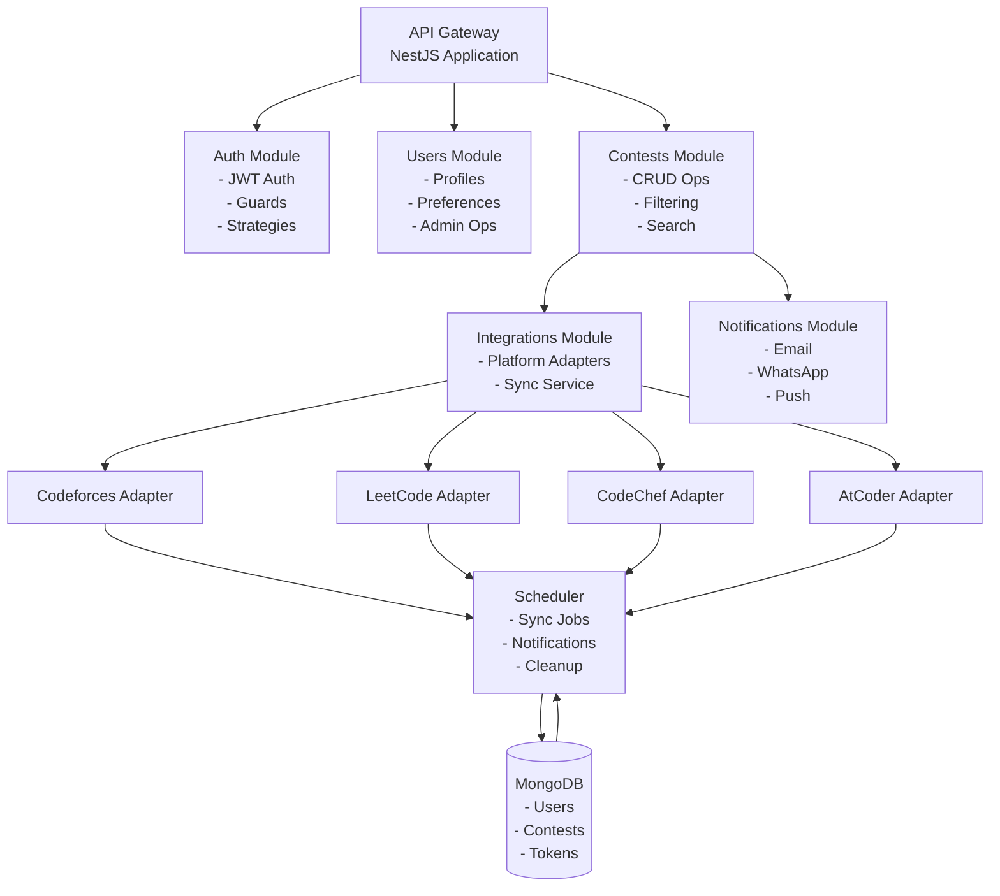
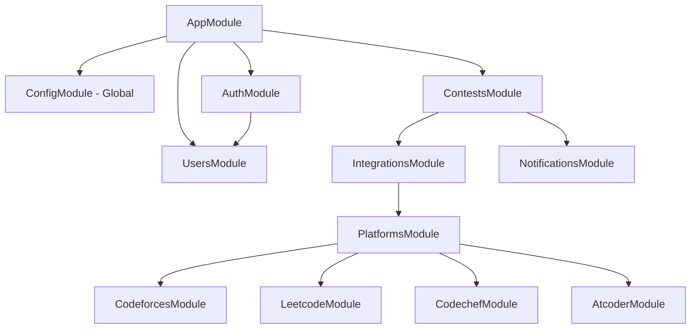

# System Architecture

High-level overview of CodeNotify's Server architecture and design principles.

## Overview

CodeNotify follows a **modular monolithic architecture** built with NestJS, MongoDB, and TypeScript. The system is designed for scalability, maintainability, and extensibility.

## Architecture Diagram



## Core Components

### 1. API Layer

**Technology**: NestJS with Express

**Responsibilities**:
- HTTP request handling
- Route management
- Middleware execution
- Request validation (Zod schemas)
- Response formatting

**Key Features**:
- RESTful API design
- JWT authentication
- Role-based access control (RBAC)
- Global exception filters
- Request/response interceptors

### 2. Business Logic Layer

**Modules**:

#### Auth Module
- User authentication (signup, signin, signout)
- JWT token generation and validation
- Refresh token mechanism
- Password hashing with bcrypt
- Guards and strategies

#### Users Module
- User profile management
- Preference management
- Admin operations (list, update role, delete)
- Account activation/deactivation

#### Contests Module
- Contest CRUD operations
- Multi-platform contest aggregation
- Advanced filtering and search
- Statistics and analytics
- Health monitoring

#### Integrations Module
- Platform adapter registry
- Contest synchronization
- API integration management
- Error handling and retry logic

#### Notifications Module
- Multi-channel notifications (Email, WhatsApp, Push)
- User preference-based filtering
- Scheduled notifications
- Template management

### 3. Data Access Layer

**Technology**: Mongoose ODM with MongoDB

**Responsibilities**:
- Database schema definition
- Data validation
- Query optimization
- Index management
- Virtual fields and methods

**Collections**:
- `users` - User accounts and preferences
- `contests` - Multi-platform contest data
- `refresh_tokens` - JWT refresh tokens

### 4. Integration Layer

**Platform Adapters**:
- Codeforces (REST API)
- LeetCode (GraphQL API)
- CodeChef (REST API)
- AtCoder (Community API)

**Features**:
- Unified adapter interface
- Automatic retry with exponential backoff
- Timeout handling
- Health checks
- Error logging

### 5. Scheduler Layer

**Technology**: NestJS Schedule (@nestjs/schedule)

**Jobs**:
- **Contest Sync** (every 6 hours) - Fetch latest contests
- **Notification Check** (every 30 minutes) - Send upcoming contest alerts
- **Token Cleanup** (daily) - Remove expired refresh tokens
- **Contest Cleanup** (daily) - Archive old contests

## Design Patterns

### 1. Adapter Pattern
Platform-specific integrations implement a common `PlatformAdapter` interface, allowing easy addition of new platforms.

### 2. Repository Pattern
Data access is abstracted through Mongoose models, separating business logic from database operations.

### 3. Dependency Injection
NestJS's built-in DI container manages dependencies, improving testability and modularity.

### 4. Factory Pattern
Platform adapters are registered using factory providers for dynamic instantiation.

### 5. Strategy Pattern
Authentication strategies (JWT, Local) are pluggable and interchangeable.

## Data Flow

### Contest Synchronization Flow

```
1. Scheduler triggers sync job (every 6 hours)
2. ContestsService calls PlatformAdapter.fetchContests()
3. Adapter makes HTTP request to platform API
4. Response is transformed to unified ContestData format
5. ContestsService upserts contests to MongoDB
6. Sync results are logged
```

### Notification Flow

```
1. Scheduler triggers notification check (every 30 minutes)
2. NotificationsService queries upcoming contests
3. For each contest, find users who:
   - Have the platform enabled in preferences
   - Haven't been notified yet
   - Match notifyBefore time window
4. Send notifications via enabled channels (Email, WhatsApp, Push)
5. Mark users as notified for this contest
```

### Authentication Flow

```
1. User submits credentials to /auth/signin
2. AuthService validates credentials
3. JWT access token (15min) + refresh token (7 days) generated
4. Tokens returned to client
5. Client includes access token in Authorization header
6. JwtAuthGuard validates token on protected routes
7. When access token expires, client calls /auth/refresh
8. New access token generated using refresh token
```

## Security Architecture

### Authentication & Authorization

- **JWT Tokens**: Stateless authentication
- **Refresh Tokens**: Stored in database for revocation
- **Password Hashing**: bcrypt with salt rounds
- **Guards**: JwtAuthGuard, RolesGuard
- **RBAC**: USER, ADMIN roles

### Data Protection

- **Environment Variables**: Sensitive config in .env
- **Input Validation**: Zod schemas for all DTOs
- **SQL Injection Prevention**: Mongoose parameterized queries
- **XSS Prevention**: Input sanitization
- **CORS**: Configured for specific origins

## Scalability Considerations

### Horizontal Scaling

- **Stateless API**: No server-side sessions
- **Database Connection Pooling**: Mongoose connection pool
- **Caching Strategy**: Ready for Redis integration
- **Load Balancing**: Can run multiple instances

### Performance Optimizations

- **Database Indexes**: Compound indexes on frequently queried fields
- **Pagination**: Cursor-based pagination for large datasets
- **Lazy Loading**: Virtual fields computed on demand
- **Query Optimization**: Projection to fetch only required fields

### Monitoring & Observability

- **Logging**: Winston logger with different levels
- **Health Checks**: `/contests/health` endpoint
- **Error Tracking**: Comprehensive error logging
- **Metrics**: Ready for Prometheus integration

## Technology Stack

| Layer | Technology | Purpose |
|-------|-----------|---------|
| **Runtime** | Node.js 18+ | JavaScript runtime |
| **Framework** | NestJS 10 | Server framework |
| **Language** | TypeScript 5 | Type-safe development |
| **Database** | MongoDB 6+ | NoSQL document store |
| **ODM** | Mongoose 8 | MongoDB object modeling |
| **Authentication** | JWT | Stateless auth |
| **Validation** | Zod | Schema validation |
| **Scheduling** | @nestjs/schedule | Cron jobs |
| **HTTP Client** | Fetch API | External API calls |
| **Password** | bcrypt | Password hashing |

## Module Dependencies



## Configuration Management

### Environment Variables

```bash
# Database
MONGODB_URI=mongodb://localhost:27017/codenotify

# JWT
JWT_SECRET=your-secret-key
JWT_EXPIRES_IN=15m
REFRESH_TOKEN_EXPIRES_IN=7d

# Server
PORT=3000
NODE_ENV=development

# Platform APIs (optional overrides)
CODEFORCES_API_URL=https://codeforces.com/api
LEETCODE_API_URL=https://leetcode.com/graphql
```

### Configuration Service

NestJS ConfigService provides type-safe access to environment variables throughout the application.

## Error Handling

### Global Exception Filter

Catches all unhandled exceptions and formats them consistently:

```typescript
{
  statusCode: number,
  message: string,
  error: string,
  timestamp: string,
  path: string
}
```

### Custom Exceptions

- `BadRequestException` - Invalid input
- `UnauthorizedException` - Auth failure
- `ForbiddenException` - Insufficient permissions
- `NotFoundException` - Resource not found
- `ConflictException` - Duplicate resource

## Testing Strategy

### Unit Tests
- Service logic testing
- Isolated component testing
- Mock dependencies

### Integration Tests
- Module integration testing
- Database operations
- API endpoint testing

### E2E Tests
- Full application flow
- Real database
- Complete request/response cycle

## Deployment Architecture

### Development
- Local MongoDB
- Hot reload with nodemon
- Debug logging enabled

### Production
- MongoDB Atlas cluster
- PM2 process manager
- Error logging only
- Environment-based configuration

## Future Enhancements

### Planned Features
- [ ] Redis caching layer
- [ ] WebSocket for real-time notifications
- [ ] GraphQL API alongside REST
- [ ] Microservices architecture
- [ ] Event-driven architecture with message queues
- [ ] API rate limiting per user
- [ ] Advanced analytics dashboard

### Scalability Roadmap
1. **Phase 1**: Redis caching for frequent queries
2. **Phase 2**: Separate read/write database replicas
3. **Phase 3**: Microservices for heavy operations
4. **Phase 4**: Event-driven architecture with Kafka/RabbitMQ

## Related Documentation

- [Module Structure](/server/modules)
- [Design Patterns](/server/patterns)
- [Platform Adapters](/server/adapters)
- [Database Design](/server/database)
- [Security](/server/security/guards)
