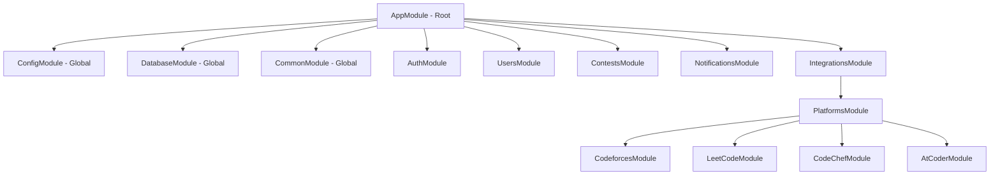

# Module Structure

CodeNotify Server follows NestJS modular architecture with clear separation of concerns and dependency injection.

## Module Hierarchy



## Core Modules

### AppModule

**Location**: `src/app.module.ts`

Root module that orchestrates all other modules.

**Imports**:
- ConfigModule (global configuration)
- DatabaseModule (MongoDB connection)
- CommonModule (shared utilities)
- AuthModule (authentication)
- UsersModule (user management)
- ContestsModule (contest management)
- NotificationsModule (notification system)
- IntegrationsModule (platform integrations)

**Providers**:
- AppService (root service)

**Controllers**:
- AppController (health check, root endpoint)

**Features**:
- Global exception filters
- Global validation pipes
- Global JWT authentication guard
- CORS configuration
- Request logging

### ConfigModule

**Location**: `src/config/config.module.ts`

Global configuration management using `@nestjs/config`.

**Features**:
- Environment variable loading
- Configuration validation
- Type-safe configuration access
- Support for `.env` files
- Default values for development

**Configuration Sections**:
```typescript
{
  // Server
  PORT: number;
  NODE_ENV: 'development' | 'production' | 'test';
  
  // Database
  MONGODB_URI: string;
  
  // JWT
  JWT_SECRET: string;
  JWT_REFRESH_SECRET: string;
  
  // Notifications
  RESEND_API_KEY: string;
  WHATSAPP_API_KEY: string;
  WHATSAPP_PHONE_NUMBER_ID: string;
  
  // CORS
  CORS_ORIGIN: string;
}
```

### DatabaseModule

**Location**: `src/database/database.module.ts`

MongoDB connection management using Mongoose.

**Features**:
- Async connection with ConfigService
- Connection pooling
- Automatic reconnection
- Connection error handling
- Schema registration

**Configuration**:
```typescript
MongooseModule.forRootAsync({
  imports: [ConfigModule],
  useFactory: async (configService: ConfigService) => ({
    uri: configService.get<string>('MONGODB_URI'),
    connectionFactory: (connection) => {
      connection.on('connected', () => {
        console.log('MongoDB connected');
      });
      return connection;
    }
  }),
  inject: [ConfigService]
})
```

### CommonModule

**Location**: `src/common/common.module.ts`

Shared utilities, decorators, pipes, and DTOs used across modules.

**Exports**:
- Constants (AUTH, VALIDATION)
- Decorators (@Public, @CurrentUser, @Roles)
- Pipes (EnumValidationPipe)
- DTOs (AuthDto, UserDto)
- Logger Service

**Components**:

#### Decorators
- `@Public()` - Mark endpoints as public (skip JWT guard)
- `@CurrentUser()` - Extract user from request
- `@Roles(...roles)` - Role-based access control

#### Pipes
- `EnumValidationPipe` - Validate enum parameters

#### Constants
```typescript
export const AUTH = {
  JWT_SECRET: 'default-secret',
  JWT_REFRESH_SECRET: 'default-refresh-secret',
  ACCESS_TOKEN_EXPIRY: '15m',
  REFRESH_TOKEN_EXPIRY: '7d',
  BCRYPT_ROUNDS: 12
};
```

## Feature Modules

### AuthModule

**Location**: `src/auth/auth.module.ts`

Handles user authentication and authorization.

**Imports**:
- UsersModule (user operations)
- JwtModule (token generation)
- PassportModule (authentication strategies)

**Providers**:
- AuthService (authentication logic)
- JwtStrategy (JWT validation)
- JwtAuthGuard (route protection)
- RolesGuard (role-based access)

**Controllers**:
- AuthController (auth endpoints)

**Exports**:
- AuthService
- JwtStrategy
- Guards

**Endpoints**:
- `POST /auth/signup` - Register
- `POST /auth/signin` - Login
- `POST /auth/signout` - Logout
- `POST /auth/refresh` - Refresh token

### UsersModule

**Location**: `src/users/users.module.ts`

User management and profile operations.

**Imports**:
- MongooseModule (User schema)

**Providers**:
- UsersService (user CRUD operations)

**Controllers**:
- UsersController (user endpoints)

**Exports**:
- UsersService (used by AuthModule)

**Endpoints**:
- `GET /users/profile` - Get profile
- `PATCH /users/profile` - Update profile
- `GET /users/preferences` - Get preferences
- `PATCH /users/preferences` - Update preferences
- `DELETE /users/account` - Delete account

**Schema**: User (with preferences, platforms, notification settings)

### ContestsModule

**Location**: `src/contests/contests.module.ts`

Contest management, syncing, and analytics.

**Imports**:
- MongooseModule (Contest schema)
- IntegrationsModule (platform adapters)
- NotificationsModule (contest notifications)

**Providers**:
- ContestsService (contest operations)
- ContestSchedulerService (automated syncing)

**Controllers**:
- ContestsController (contest endpoints)

**Exports**:
- ContestsService

**Endpoints**:
- `GET /contests` - List contests
- `GET /contests/:id` - Get contest
- `POST /contests` - Create contest (admin)
- `PATCH /contests/:id` - Update contest (admin)
- `DELETE /contests/:id` - Delete contest (admin)
- `GET /contests/platform/:platform` - Platform contests
- `GET /contests/upcoming` - Upcoming contests
- `GET /contests/running` - Running contests
- `GET /contests/finished` - Finished contests
- `GET /contests/search` - Search contests
- `GET /contests/stats` - Contest statistics
- `POST /contests/sync/:platform` - Sync platform (admin)
- `POST /contests/sync/all` - Sync all platforms (admin)

**Scheduled Jobs**:
- Contest sync (every 6 hours)
- Cleanup old contests (daily)

### NotificationsModule

**Location**: `src/notifications/notifications.module.ts`

Multi-channel notification system.

**Imports**:
- MongooseModule (Notification schema)
- HttpModule (external API calls)

**Providers**:
- NotificationsService (notification logic)
- EmailService (Resend integration)
- WhatsAppService (WhatsApp Cloud API)
- PushService (push notifications)

**Controllers**:
- NotificationsController (notification endpoints)

**Exports**:
- NotificationsService

**Endpoints**:
- `GET /notifications` - List notifications
- `GET /notifications/:id` - Get notification
- `PATCH /notifications/:id/read` - Mark as read
- `PATCH /notifications/read-all` - Mark all as read
- `DELETE /notifications/:id` - Delete notification
- `POST /notifications/test` - Test notification

**Scheduled Jobs**:
- Notification dispatch (every 30 minutes)

**Channels**:
- Email (Resend)
- WhatsApp (Meta Cloud API)
- Push (Web Push API)

### IntegrationsModule

**Location**: `src/integrations/integrations.module.ts`

Platform adapter orchestration.

**Imports**:
- PlatformsModule (all platform adapters)

**Exports**:
- PlatformsModule

**Sub-Modules**:
- CodeforcesModule
- LeetCodeModule
- CodeChefModule
- AtCoderModule

## Platform Modules

### PlatformsModule

**Location**: `src/integrations/platforms/platforms.module.ts`

Registry for all platform adapters using factory pattern.

**Providers**:
```typescript
{
  provide: PLATFORM_ADAPTERS,
  useFactory: (
    codeforces: CodeforcesAdapter,
    leetcode: LeetCodeAdapter,
    codechef: CodeChefAdapter,
    atcoder: AtCoderAdapter
  ) => [codeforces, leetcode, codechef, atcoder],
  inject: [
    CodeforcesAdapter,
    LeetCodeAdapter,
    CodeChefAdapter,
    AtCoderAdapter
  ]
}
```

**Exports**:
- PLATFORM_ADAPTERS (adapter registry)

### CodeforcesModule

**Location**: `src/integrations/platforms/codeforces/codeforces.module.ts`

Codeforces API integration.

**Providers**:
- CodeforcesAdapter (REST API client)

**Features**:
- Contest fetching from Codeforces API
- Contest type detection (CF, CF_IOI, ICPC)
- Phase mapping (BEFORE, CODING, FINISHED)
- Difficulty estimation
- Participant count tracking

### LeetCodeModule

**Location**: `src/integrations/platforms/leetcode/leetcode.module.ts`

LeetCode GraphQL API integration.

**Providers**:
- LeetCodeAdapter (GraphQL client)

**Features**:
- GraphQL query execution
- Weekly/Biweekly contest detection
- Virtual contest support
- Contest image metadata
- Title slug handling

### CodeChefModule

**Location**: `src/integrations/platforms/codechef/codechef.module.ts`

CodeChef REST API integration.

**Providers**:
- CodeChefAdapter (REST API client)

**Features**:
- Present/Future/Past contest fetching
- Contest type detection (STARTERS, LUNCH_TIME, COOK_OFF, LONG)
- Difficulty mapping
- Division-based contests

### AtCoderModule

**Location**: `src/integrations/platforms/atcoder/atcoder.module.ts`

AtCoder community API integration.

**Providers**:
- AtCoderAdapter (Community API client)

**Features**:
- Contest fetching from AtCoder Problems API
- Contest type detection (ABC, ARC, AGC, AHC)
- Rate change metadata
- Time-based filtering

## Module Communication

### Dependency Injection Flow

```mermaid
graph TB
    subgraph ContestsService
        CS[ContestsService]
        CS -->|@InjectModel| MongoDB1[(MongoDB)]
        CS -->|@Inject| PlatformAdapters[Platform Adapters]
        CS --> NotifService1[NotificationsService]
    end
    
    subgraph NotificationsService
        NS[NotificationsService]
        NS -->|@InjectModel| MongoDB2[(MongoDB)]
        NS --> EmailService[EmailService → Resend API]
        NS --> WhatsAppService[WhatsAppService → WhatsApp API]
        NS --> PushService[PushService → Web Push]
    end
    
    subgraph AuthService
        AS[AuthService]
        AS --> UsersService[UsersService → User operations]
        AS --> JwtService[JwtService → Token generation]
        AS --> ConfigService[ConfigService → Environment config]
    end
```

### Module Imports Best Practices

1. **Global Modules**: ConfigModule, DatabaseModule, CommonModule
2. **Feature Modules**: Import only what's needed
3. **Circular Dependencies**: Avoided using forwardRef when necessary
4. **Exports**: Only export what other modules need

## Testing Modules

Each module has corresponding test files:
- `*.module.spec.ts` - Module configuration tests
- `*.service.spec.ts` - Service unit tests
- `*.controller.spec.ts` - Controller unit tests
- `*.e2e-spec.ts` - End-to-end tests

## Related Documentation

- [Auth Module](/server/modules/auth) - Authentication details
- [Users Module](/server/modules/users) - User management
- [Contests Module](/server/modules/contests) - Contest operations
- [Notifications Module](/server/modules/notifications) - Notification system
- [Platform Adapters](/server/adapters) - Platform integration patterns
