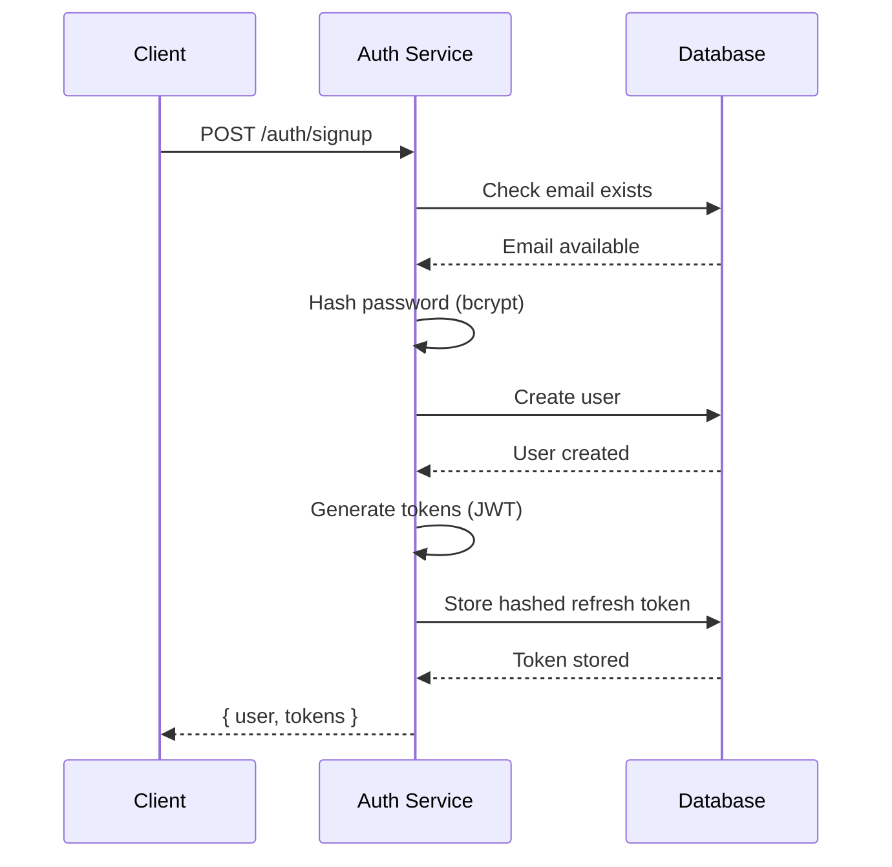
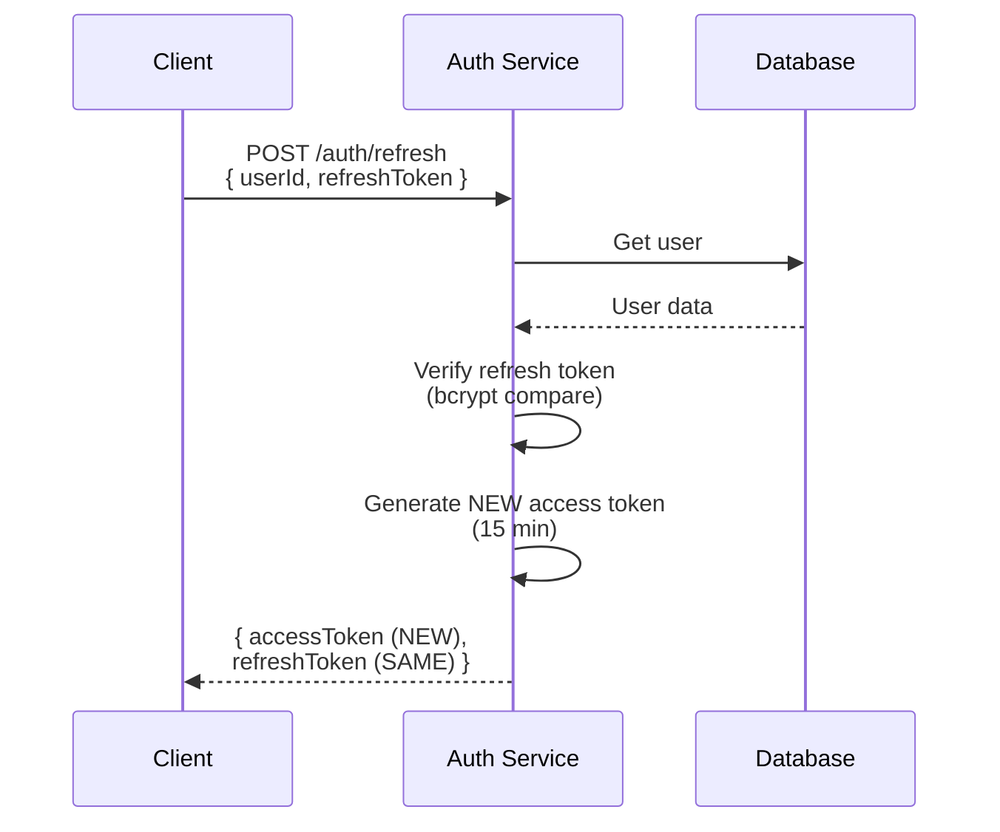

# Auth Module

Complete authentication and authorization system for CodeNotify.

## Overview

The Auth Module handles user authentication, token management, and authorization using JWT (JSON Web Tokens) with refresh token rotation.

## Module Structure

```mermaid
graph TB
    AuthRoot[auth/]
    
    Module[auth.module.ts<br/>Module configuration]
    Controller[auth.controller.ts<br/>REST endpoints]
    Service[auth.service.ts<br/>Business logic]
    
    Decorators[decorators/]
    RolesDecorator[roles.decorator.ts<br/>@Roles decorator]
    
    Guards[guards/]
    JwtGuard[jwt-auth.guard.ts<br/>JWT authentication guard]
    RolesGuard[roles.guard.ts<br/>Role-based access guard]
    
    Strategies[strategies/]
    JwtStrategy[jwt.strategy.ts<br/>Passport JWT strategy]
    
    AuthRoot --> Module
    AuthRoot --> Controller
    AuthRoot --> Service
    AuthRoot --> Decorators
    AuthRoot --> Guards
    AuthRoot --> Strategies
    
    Decorators --> RolesDecorator
    Guards --> JwtGuard
    Guards --> RolesGuard
    Strategies --> JwtStrategy
```

## Dependencies

### Imports
- **UsersModule**: User CRUD operations
- **PassportModule**: Authentication middleware
- **JwtModule**: Token generation and validation
- **ConfigModule**: Environment configuration

### Providers
- AuthService
- JwtStrategy
- JwtAuthGuard
- RolesGuard

### Exports
- AuthService (used by other modules)

## Configuration

### JWT Module Setup

```typescript
JwtModule.registerAsync({
  imports: [ConfigModule],
  useFactory: (configService: ConfigService) => ({
    secret: configService.get<string>('JWT_SECRET', AUTH.JWT_SECRET),
    signOptions: { expiresIn: '15m' },
  }),
  inject: [ConfigService],
})
```

### Token Configuration

| Token Type | Secret | Expiry | Purpose |
|------------|--------|--------|---------|
| Access Token | `JWT_SECRET` | 15 minutes | API authentication |
| Refresh Token | `JWT_REFRESH_SECRET` | 7 days | Token renewal |

## API Endpoints

### 1. Sign Up

**Endpoint**: `POST /auth/signup`  
**Access**: Public  
**Status Code**: 201 Created

**Request**:
```typescript
{
  name: string;          // Min 2 characters
  email: string;         // Valid email, unique
  password: string;      // Min 6 characters
  phoneNumber?: string;  // Optional
}
```

**Response**:
```typescript
{
  user: {
    id: string;
    email: string;
    name: string;
    phoneNumber?: string;
    role: string;
  };
  accessToken: string;
  refreshToken: string;
}
```

**Process**:
1. Validate input with Zod schema
2. Check if email already exists (409 Conflict)
3. Hash password with bcrypt (12 salt rounds)
4. Create user in database
5. Generate email verification OTP
6. Send verification email
7. Return user data (isEmailVerified: false)

### 2. Sign In

**Endpoint**: `POST /auth/signin`  
**Access**: Public  
**Status Code**: 200 OK

**Request**:
```typescript
{
  email: string;
  password: string;
}
```

**Response**: Same as Sign Up

**Process**:
1. Find user by email (401 if not found)
2. Check if account is active (401 if deactivated)
3. Verify password with bcrypt (401 if invalid)
4. Generate new access + refresh tokens
5. Hash and store new refresh token
6. Update lastLogin timestamp
7. Return user data and tokens

### 3. Verify Email

**Endpoint**: `POST /auth/verify-email`  
**Access**: Public  
**Status Code**: 200 OK

**Request**:
```typescript
{
  email: string;
  otp: string; 
}
```

**Response**:
```typescript
{
  message: "Email verified successfully",
  user: UserProfile
}
```

**Process**:
1. Find user by email (404 if not found)
2. Verify OTP code against stored session/redis
3. Check if OTP is expired
4. Update user `isEmailVerified` to true
5. Return success message

### 4. Sign Out

**Endpoint**: `POST /auth/signout`  
**Access**: Protected (JWT required)  
**Status Code**: 200 OK

**Request**: No body (user from JWT)

**Response**:
```typescript
{
  message: "Successfully signed out"
}
```

**Process**:
1. Extract user from JWT token
2. Validate user exists (401 if not found)
3. Clear refresh token from database (set to null)
4. Return success message

**Note**: Access token remains valid until expiry (15 minutes). For immediate invalidation, implement token blacklist.

### 4. Refresh Token

**Endpoint**: `POST /auth/refresh`  
**Access**: Public  
**Status Code**: 200 OK

**Request**:
```typescript
{
  userId: string;
  refreshToken: string;
}
```

**Response**:
```typescript
{
  accessToken: string;      // NEW token
  refreshToken: string;     // SAME token
}
```

**Process**:
1. Find user by userId (401 if not found)
2. Check if user has refresh token (401 if null)
3. Compare provided token with stored hash (401 if mismatch)
4. Generate NEW access token (15 min expiry)
5. Return new access token + SAME refresh token

**Important**: Refresh token is NOT regenerated. This prevents rotation issues and maintains 7-day session duration.

## Authentication Flow

### Initial Authentication (Sign Up/Sign In)



### Token Refresh Flow



## Security Implementation

### Password Hashing

```typescript
// Sign Up / Password Change
const saltRounds = 12;
const hashedPassword = await bcrypt.hash(password, saltRounds);

// Sign In / Verification
const isValid = await bcrypt.compare(password, hashedPassword);
```

**Configuration**:
- Algorithm: bcrypt
- Salt Rounds: 12
- Automatic salt generation
- Constant-time comparison

### Token Generation

```typescript
const payload: JwtPayload = {
  sub: userId,      // Subject (user ID)
  email: email,     // User email
  role: role        // User role (user/admin)
};

// Access Token
const accessToken = await jwtService.signAsync(payload, {
  secret: JWT_SECRET,
  expiresIn: '15m'
});

// Refresh Token
const refreshToken = await jwtService.signAsync(payload, {
  secret: JWT_REFRESH_SECRET,
  expiresIn: '7d'
});
```

### Refresh Token Storage

```typescript
// Hash before storage
const hashedRefreshToken = await bcrypt.hash(refreshToken, 12);
await usersService.updateRefreshToken(userId, hashedRefreshToken);

// Verify on refresh
const matches = await bcrypt.compare(providedToken, storedHash);
```

**Why hash refresh tokens?**
- Prevents token theft if database is compromised
- Even with database access, attacker can't use tokens
- Follows security best practices

## Guards & Strategies

### JWT Strategy

**File**: `strategies/jwt.strategy.ts`

```typescript
@Injectable()
export class JwtStrategy extends PassportStrategy(Strategy) {
  constructor(configService: ConfigService) {
    super({
      jwtFromRequest: ExtractJwt.fromAuthHeaderAsBearerToken(),
      ignoreExpiration: false,
      secretOrKey: configService.get<string>('JWT_SECRET'),
    });
  }

  async validate(payload: JwtPayload) {
    return {
      id: payload.sub,
      email: payload.email,
      role: payload.role
    };
  }
}
```

**Purpose**: Validates JWT tokens and extracts user information

### JWT Auth Guard

**File**: `guards/jwt-auth.guard.ts`

```typescript
@Injectable()
export class JwtAuthGuard extends AuthGuard('jwt') {
  canActivate(context: ExecutionContext) {
    // Check if route is marked as @Public()
    const isPublic = this.reflector.getAllAndOverride<boolean>(
      IS_PUBLIC_KEY,
      [context.getHandler(), context.getClass()]
    );
    
    if (isPublic) {
      return true;
    }
    
    return super.canActivate(context);
  }
}
```

**Purpose**: Protects routes, allows @Public() bypass

### Roles Guard

**File**: `guards/roles.guard.ts`

```typescript
@Injectable()
export class RolesGuard implements CanActivate {
  canActivate(context: ExecutionContext): boolean {
    const requiredRoles = this.reflector.getAllAndOverride<string[]>(
      ROLES_KEY,
      [context.getHandler(), context.getClass()]
    );
    
    if (!requiredRoles) {
      return true;
    }
    
    const { user } = context.switchToHttp().getRequest();
    return requiredRoles.some((role) => user.role === role);
  }
}
```

**Purpose**: Enforces role-based access control

## Decorators

### @Public()

**File**: `common/decorators/public.decorator.ts`

```typescript
export const IS_PUBLIC_KEY = 'isPublic';
export const Public = () => SetMetadata(IS_PUBLIC_KEY, true);
```

**Usage**:
```typescript
@Public()
@Post('signup')
async signup(@Body() dto: CreateUserDto) {
  // No JWT required
}
```

### @Roles()

**File**: `auth/decorators/roles.decorator.ts`

```typescript
export const ROLES_KEY = 'roles';
export const Roles = (...roles: string[]) => SetMetadata(ROLES_KEY, roles);
```

**Usage**:
```typescript
@Roles('admin')
@Delete('users/:id')
async deleteUser(@Param('id') id: string) {
  // Only admin can access
}
```

### @CurrentUser()

**File**: `common/decorators/current-user.decorator.ts`

```typescript
export const CurrentUser = createParamDecorator(
  (data: unknown, ctx: ExecutionContext) => {
    const request = ctx.switchToHttp().getRequest();
    return request.user;
  },
);
```

**Usage**:
```typescript
@Post('signout')
async signout(@CurrentUser() user: UserDocument) {
  // User extracted from JWT
}
```

## Error Handling

### Common Errors

| Error | Status | Cause | Solution |
|-------|--------|-------|----------|
| Invalid credentials | 401 | Wrong email/password | Check credentials |
| Account deactivated | 401 | User.isActive = false | Contact admin |
| Email already exists | 409 | Duplicate email | Use different email |
| Access denied | 401 | Invalid/expired token | Refresh or re-login |
| User not found | 401 | Invalid userId | Check user exists |

### Error Responses

```typescript
// 401 Unauthorized
{
  statusCode: 401,
  message: "Invalid credentials",
  error: "Unauthorized"
}

// 409 Conflict
{
  statusCode: 409,
  message: "User with this email already exists",
  error: "Conflict"
}
```

## Testing

### Unit Tests

```typescript
describe('AuthService', () => {
  it('should hash password on signup', async () => {
    const result = await authService.signup(createUserDto);
    expect(result.user.password).not.toBe(createUserDto.password);
  });

  it('should generate tokens on signin', async () => {
    const result = await authService.signin(signinDto);
    expect(result.accessToken).toBeDefined();
    expect(result.refreshToken).toBeDefined();
  });

  it('should return same refresh token on refresh', async () => {
    const result = await authService.refreshAccessToken(userId, token);
    expect(result.refreshToken).toBe(token);
  });
});
```

### E2E Tests

```typescript
describe('Auth (e2e)', () => {
  it('/auth/signup (POST)', () => {
    return request(app.getHttpServer())
      .post('/auth/signup')
      .send(createUserDto)
      .expect(201)
      .expect((res) => {
        expect(res.body.accessToken).toBeDefined();
      });
  });
});
```

## Best Practices

### ✅ Do

1. **Always hash passwords** before storage
2. **Use environment variables** for secrets
3. **Implement rate limiting** on auth endpoints
4. **Log authentication events** for security monitoring
5. **Validate all inputs** with Zod schemas
6. **Use HTTPS** in production
7. **Implement token refresh** before expiry
8. **Clear tokens** on logout

### ❌ Don't

1. **Don't store plain text passwords**
2. **Don't expose sensitive data** in responses
3. **Don't use weak secrets** (use strong random strings)
4. **Don't skip validation**
5. **Don't log passwords** or tokens
6. **Don't share JWT secrets** between environments
7. **Don't implement custom crypto** (use bcrypt/JWT libraries)

## Production Checklist

- [ ] Strong JWT secrets (32+ random characters)
- [ ] HTTPS enabled
- [ ] Rate limiting configured
- [ ] Password requirements enforced (8+ chars, complexity)
- [ ] Email verification implemented
- [ ] Account lockout after failed attempts
- [ ] Security headers configured (Helmet)
- [ ] CORS properly configured
- [ ] Logging and monitoring enabled
- [ ] Token blacklist for immediate logout (optional)
- [ ] 2FA support (optional)

## Related Documentation

- [Sign Up Endpoint](/api/auth/signup) - User registration
- [Sign In Endpoint](/api/auth/signin) - User authentication
- [Refresh Token Endpoint](/api/auth/refresh) - Token renewal
- [Sign Out Endpoint](/api/auth/signout) - Session termination
- [JWT Strategy](/api/auth/jwt-strategy) - Token validation
- [Users Module](/server/modules/users) - User management
- [JWT Authentication](/server/security/jwt) - Security implementation
