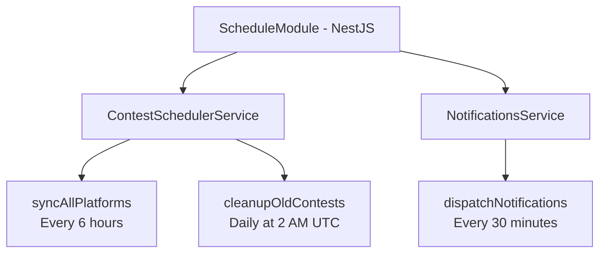

# Scheduler & Background Jobs

CodeNotify uses `@nestjs/schedule` for cron-based automated tasks.

## Overview

The scheduler handles three main responsibilities:
1. **Contest Synchronization** - Fetch latest contests from platforms (every 6 hours)
2. **Notification Dispatch** - Send notifications to users (every 30 minutes)
3. **Data Cleanup** - Remove old/expired data (daily at 2 AM UTC)

## Architecture



## Configuration

### Module Setup

```typescript
// app.module.ts
@Module({
  imports: [
    ScheduleModule.forRoot(), // Enable scheduling
    // ... other modules
  ]
})
export class AppModule {}
```

### Cron Expression Format

```
* * * * * *
│ │ │ │ │ │
│ │ │ │ │ └──── day of week (0-7, 0 and 7 are Sunday)
│ │ │ │ └────── month (1-12)
│ │ │ └──────── day of month (1-31)
│ │ └────────── hour (0-23)
│ └──────────── minute (0-59)
└────────────── second (optional, 0-59)
```

## Scheduled Jobs

### 1. Contest Sync Job

**Purpose**: Fetch latest contests from all platforms

**Schedule**: Every 6 hours (0 */6 * * *)

**Implementation**:

```typescript
@Injectable()
export class ContestSchedulerService {
  private readonly logger = new Logger(ContestSchedulerService.name);
  
  constructor(
    private readonly contestsService: ContestsService,
    private readonly notificationsService: NotificationsService
  ) {}
  
  @Cron('0 */6 * * *', {
    name: 'sync-contests',
    timeZone: 'UTC'
  })
  async syncAllPlatforms() {
    this.logger.log('Starting scheduled contest sync');
    
    try {
      const results = await this.contestsService.syncAllPlatforms();
      
      this.logger.log('Contest sync completed', {
        results,
        timestamp: new Date().toISOString()
      });
      
      // Trigger notifications for newly added contests
      await this.notificationsService.checkAndNotify();
      
    } catch (error) {
      this.logger.error('Contest sync failed', error.stack);
    }
  }
}
```

**Execution Times** (UTC):
- 00:00 (Midnight)
- 06:00 (6 AM)
- 12:00 (Noon)
- 18:00 (6 PM)

**Process**:
1. Iterate through all registered platform adapters
2. Fetch contests from each platform
3. Upsert contests into database (create or update)
4. Log sync results (synced, updated, failed counts)
5. Trigger notification check for new contests

**Error Handling**:
- Individual platform failures don't stop other platforms
- Errors are logged with stack traces
- Failed syncs are tracked in results
- Retry logic in platform adapters (3 attempts)

### 2. Notification Dispatch Job

**Purpose**: Send notifications to users for upcoming contests

**Schedule**: Every 30 minutes (*/30 * * * *)

**Implementation**:

```typescript
@Injectable()
export class NotificationsService {
  @Cron('*/30 * * * *', {
    name: 'dispatch-notifications',
    timeZone: 'UTC'
  })
  async dispatchNotifications() {
    this.logger.log('Starting notification dispatch');
    
    try {
      // Get all active users with notification preferences
      const users = await this.usersService.findActiveUsers();
      
      for (const user of users) {
        await this.checkAndNotifyUser(user);
      }
      
      this.logger.log(`Notifications dispatched to ${users.length} users`);
      
    } catch (error) {
      this.logger.error('Notification dispatch failed', error.stack);
    }
  }
  
  private async checkAndNotifyUser(user: UserDocument) {
    const { platforms, notifyBefore, notificationChannels } = user.preferences;
    
    // Calculate notification window
    const notifyAfter = new Date(Date.now() + notifyBefore * 60 * 60 * 1000);
    const notifyBefore = new Date(Date.now() + (notifyBefore + 1) * 60 * 60 * 1000);
    
    // Find contests in notification window
    const contests = await this.contestsService.findContestsInWindow(
      platforms,
      notifyAfter,
      notifyBefore
    );
    
    // Send notifications through configured channels
    for (const contest of contests) {
      if (notificationChannels.includes('email')) {
        await this.emailService.sendContestNotification(user, contest);
      }
      if (notificationChannels.includes('whatsapp')) {
        await this.whatsappService.sendContestNotification(user, contest);
      }
      if (notificationChannels.includes('push')) {
        await this.pushService.sendContestNotification(user, contest);
      }
      
      // Mark contest as notified for this user
      await this.markAsNotified(user.id, contest.id);
    }
  }
}
```

**Execution Times** (UTC):
- Every 30 minutes: 00:00, 00:30, 01:00, 01:30, ...

**Process**:
1. Fetch all active users
2. For each user, check notification preferences
3. Find contests in user's notification window
4. Send notifications through configured channels
5. Mark contests as notified to prevent duplicates
6. Log notification statistics

**Notification Window**:
- User sets `notifyBefore` (1-168 hours)
- System checks contests starting in that window
- Prevents duplicate notifications with `isNotified` flag

### 3. Cleanup Job

**Purpose**: Remove old and expired data

**Schedule**: Daily at 2 AM UTC (0 2 * * *)

**Implementation**:

```typescript
@Injectable()
export class ContestSchedulerService {
  @Cron('0 2 * * *', {
    name: 'cleanup-old-data',
    timeZone: 'UTC'
  })
  async cleanupOldContests() {
    this.logger.log('Starting data cleanup');
    
    try {
      // Delete finished contests older than 30 days
      const thirtyDaysAgo = new Date(Date.now() - 30 * 24 * 60 * 60 * 1000);
      
      const result = await this.contestsService.deleteOldContests(thirtyDaysAgo);
      
      this.logger.log(`Cleanup completed: ${result.deletedCount} contests removed`);
      
      // Cleanup old notifications (older than 90 days)
      const ninetyDaysAgo = new Date(Date.now() - 90 * 24 * 60 * 60 * 1000);
      await this.notificationsService.deleteOldNotifications(ninetyDaysAgo);
      
    } catch (error) {
      this.logger.error('Cleanup failed', error.stack);
    }
  }
}
```

**Execution Time**: 2:00 AM UTC daily

**Cleanup Rules**:
- **Contests**: Delete finished contests older than 30 days
- **Notifications**: Delete read notifications older than 90 days
- **Inactive Users**: Mark users inactive after 180 days of no login
- **Expired Tokens**: Clear expired refresh tokens

## Job Management

### Manual Trigger

```typescript
// Trigger sync manually via API (admin only)
@Post('contests/sync/all')
@UseGuards(JwtAuthGuard, RolesGuard)
@Roles('admin')
async triggerSync() {
  await this.contestSchedulerService.syncAllPlatforms();
  return { message: 'Sync triggered successfully' };
}
```

### Disable Job

```typescript
@Cron('0 */6 * * *', {
  name: 'sync-contests',
  disabled: process.env.NODE_ENV === 'test' // Disable in tests
})
```

### Dynamic Scheduling

```typescript
import { SchedulerRegistry } from '@nestjs/schedule';

constructor(private schedulerRegistry: SchedulerRegistry) {}

// Get job
const job = this.schedulerRegistry.getCronJob('sync-contests');

// Stop job
job.stop();

// Start job
job.start();

// Get next execution time
const nextDate = job.nextDate();
```

## Monitoring

### Job Execution Logs

```typescript
@Cron('0 */6 * * *')
async syncAllPlatforms() {
  const startTime = Date.now();
  
  try {
    const results = await this.contestsService.syncAllPlatforms();
    
    const duration = Date.now() - startTime;
    this.logger.log({
      job: 'sync-contests',
      status: 'success',
      duration: `${duration}ms`,
      results
    });
    
  } catch (error) {
    this.logger.error({
      job: 'sync-contests',
      status: 'failed',
      error: error.message,
      stack: error.stack
    });
  }
}
```

### Metrics

Track job performance:
- Execution duration
- Success/failure rate
- Items processed
- Error frequency

### Alerts

Set up alerts for:
- Job failures
- Long execution times (>5 minutes)
- High error rates
- Missed executions

## Best Practices

### 1. **Idempotency**

Jobs should be safe to run multiple times:

```typescript
async syncPlatform(platform: ContestPlatform) {
  // Upsert instead of insert
  await this.contestModel.updateOne(
    { platformId, platform },
    { $set: contestData },
    { upsert: true }
  );
}
```

### 2. **Error Handling**

Catch and log all errors:

```typescript
try {
  await this.processJob();
} catch (error) {
  this.logger.error('Job failed', error.stack);
  // Don't throw - let other jobs continue
}
```

### 3. **Timeout Protection**

Prevent long-running jobs:

```typescript
async syncWithTimeout() {
  const timeout = setTimeout(() => {
    throw new Error('Job timeout after 10 minutes');
  }, 10 * 60 * 1000);
  
  try {
    await this.sync();
  } finally {
    clearTimeout(timeout);
  }
}
```

### 4. **Graceful Shutdown**

Handle application shutdown:

```typescript
async onModuleDestroy() {
  // Wait for running jobs to complete
  await this.waitForJobsToComplete();
}
```

## Testing

### Mock Scheduler

```typescript
describe('ContestSchedulerService', () => {
  let service: ContestSchedulerService;
  
  beforeEach(async () => {
    const module = await Test.createTestingModule({
      providers: [
        ContestSchedulerService,
        {
          provide: ContestsService,
          useValue: {
            syncAllPlatforms: jest.fn()
          }
        }
      ]
    }).compile();
    
    service = module.get(ContestSchedulerService);
  });
  
  it('should sync contests', async () => {
    await service.syncAllPlatforms();
    expect(contestsService.syncAllPlatforms).toHaveBeenCalled();
  });
});
```

### Disable in Tests

```typescript
ScheduleModule.forRoot({
  disabled: process.env.NODE_ENV === 'test'
})
```

## Related Documentation

- [Contests Module](/server/modules/contests) - Contest management
- [Notifications Module](/server/modules/notifications) - Notification system
- [Platform Adapters](/server/adapters) - Platform integrations
