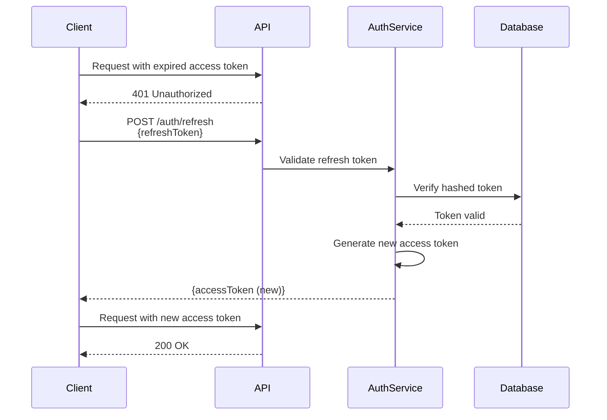

# JWT Authentication

JSON Web Token (JWT) implementation for stateless authentication in CodeNotify.

## Overview

CodeNotify uses JWT for secure, stateless authentication. Tokens are signed using HS256 algorithm and contain user identity and role information.

## Token Types

### Access Token
- **Expiry**: 15 minutes
- **Purpose**: API authentication
- **Storage**: Client-side (memory or secure storage)
- **Secret**: `JWT_SECRET` environment variable

### Refresh Token
- **Expiry**: 7 days
- **Purpose**: Obtain new access tokens
- **Storage**: Database (hashed) + Client-side
- **Secret**: `JWT_REFRESH_SECRET` environment variable

## Token Structure

### Payload

```typescript
interface JwtPayload {
  sub: string;      // User ID
  email: string;    // User email
  role: string;     // User role (user/admin)
  iat: number;      // Issued at timestamp
  exp: number;      // Expiration timestamp
}
```

### Example Token

```
eyJhbGciOiJIUzI1NiIsInR5cCI6IkpXVCJ9.
eyJzdWIiOiI2NTc4OTBhYmNkZWYxMjM0NTY3ODkwIiwiZW1haWwiOiJ1c2VyQGV4YW1wbGUuY29tIiwicm9sZSI6InVzZXIiLCJpYXQiOjE3MDAwMDAwMDAsImV4cCI6MTcwMDAwMDkwMH0.
signature_here
```

## Configuration

### Environment Variables

```bash
# JWT Secrets (use strong random strings)
JWT_SECRET=your-super-secret-key-min-32-chars
JWT_REFRESH_SECRET=your-refresh-secret-key-min-32-chars

# Token Expiry
JWT_EXPIRES_IN=15m
REFRESH_TOKEN_EXPIRES_IN=7d
```

### NestJS Configuration

```typescript
// auth.module.ts
JwtModule.registerAsync({
  imports: [ConfigModule],
  useFactory: (configService: ConfigService) => ({
    secret: configService.get<string>('JWT_SECRET'),
    signOptions: { 
      expiresIn: '15m',
      algorithm: 'HS256'
    },
  }),
  inject: [ConfigService],
})
```

## Token Generation

### Sign Up / Sign In

```typescript
async generateTokens(user: UserDocument) {
  const payload: JwtPayload = {
    sub: user.id,
    email: user.email,
    role: user.role,
  };

  const accessToken = await this.jwtService.signAsync(payload, {
    secret: this.configService.get('JWT_SECRET'),
    expiresIn: '15m',
  });

  const refreshToken = await this.jwtService.signAsync(payload, {
    secret: this.configService.get('JWT_REFRESH_SECRET'),
    expiresIn: '7d',
  });

  return { accessToken, refreshToken };
}
```

## Token Validation

### JWT Strategy

```typescript
@Injectable()
export class JwtStrategy extends PassportStrategy(Strategy) {
  constructor(configService: ConfigService) {
    super({
      jwtFromRequest: ExtractJwt.fromAuthHeaderAsBearerToken(),
      ignoreExpiration: false,
      secretOrKey: configService.get<string>('JWT_SECRET'),
    });
  }

  async validate(payload: JwtPayload) {
    return {
      id: payload.sub,
      email: payload.email,
      role: payload.role,
    };
  }
}
```

### Usage in Routes

```typescript
@UseGuards(JwtAuthGuard)
@Get('profile')
async getProfile(@CurrentUser() user: UserDocument) {
  return user;
}
```

## Security Best Practices

### ✅ Do

1. **Use Strong Secrets**: Minimum 32 characters, random
2. **Short Access Token Expiry**: 15 minutes or less
3. **HTTPS Only**: Never send tokens over HTTP
4. **Secure Storage**: Use httpOnly cookies or secure storage
5. **Validate on Every Request**: Check token signature and expiry
6. **Implement Refresh Tokens**: Allow token renewal without re-login
7. **Hash Refresh Tokens**: Store hashed in database

### ❌ Don't

1. **Don't Store Sensitive Data**: Keep payload minimal
2. **Don't Use Weak Secrets**: Avoid predictable strings
3. **Don't Share Secrets**: Different secrets per environment
4. **Don't Ignore Expiry**: Always check token expiration
5. **Don't Log Tokens**: Never log full tokens
6. **Don't Use Long Expiry**: Keep access tokens short-lived

## Token Refresh Flow



## Error Handling

### Common Errors

| Error | Status | Cause | Solution |
|-------|--------|-------|----------|
| Invalid token | 401 | Malformed or tampered token | Re-authenticate |
| Token expired | 401 | Access token expired | Use refresh token |
| Invalid signature | 401 | Wrong secret or tampered | Re-authenticate |
| Missing token | 401 | No Authorization header | Provide token |

### Error Response

```json
{
  "statusCode": 401,
  "message": "Unauthorized",
  "error": "Invalid or expired token"
}
```

## Testing

### Unit Tests

```typescript
describe('JWT Service', () => {
  it('should generate valid access token', async () => {
    const tokens = await authService.generateTokens(user);
    expect(tokens.accessToken).toBeDefined();
    
    const decoded = jwtService.decode(tokens.accessToken);
    expect(decoded.sub).toBe(user.id);
  });

  it('should reject expired token', async () => {
    const expiredToken = await jwtService.signAsync(payload, {
      expiresIn: '-1s'
    });
    
    await expect(
      jwtService.verifyAsync(expiredToken)
    ).rejects.toThrow();
  });
});
```

## Related Documentation

- [Auth Module](/server/modules/auth)
- [Authentication API](/api/authentication)
- [Security Guards](/server/security/guards)
